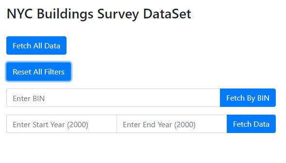
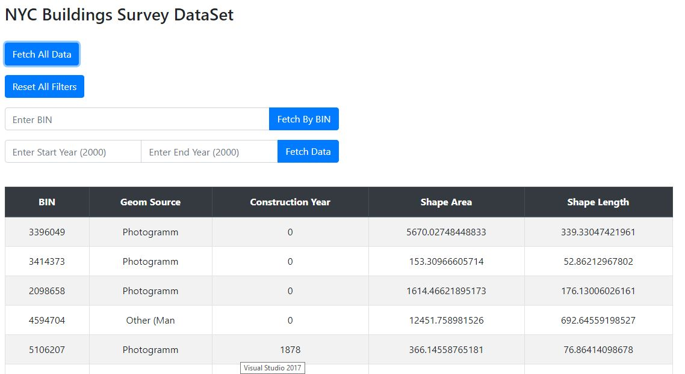
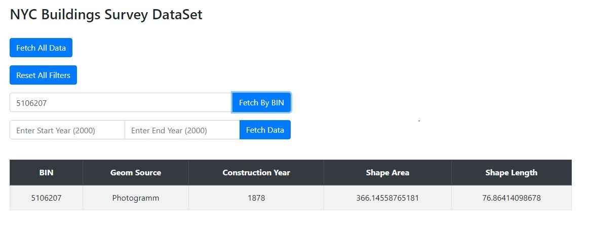
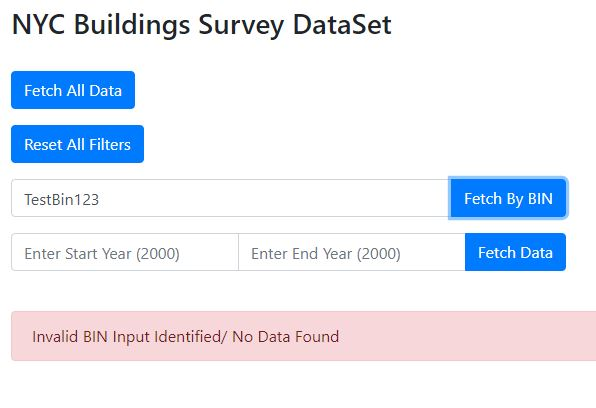
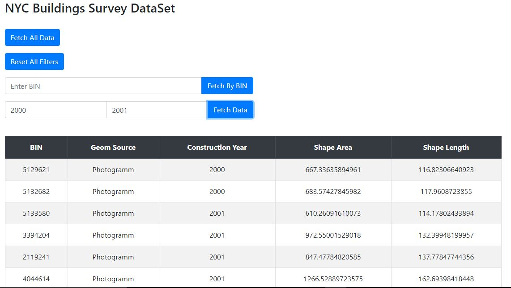
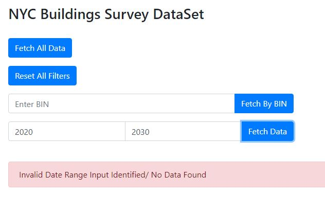

# Analyzing NYC Building footprints dataset

Back-end engineer assignment for topos inc.

Exract data, load into database with an api written using Go. Includes a simple frontend

## Getting Started

These instructions will get you a copy of the project up and running on your local machine for development and testing purposes.

### Prerequisites

- Install Go
- Install mongodb
- Download the dataset
  Download a copy of the dataset from https://data.cityofnewyork.us/Housing-Development/Building-Footprints/nqwf-w8eh
  Export as building.csv file. Make sure the filename stays the same. Save it to the current project folder.

MongoDB Driver

```
go get gopkg.in/mgo.v2
```

Gorilla/mux - URL router

```
go get github.com/gorilla/mux
```

### Running the code

Open two windows of terminal/cmd

Run mongodb server on one

```
mongod
```

One the other, change directory to the project folder and build

```
go build
```

Run the app

```
go run app.go
```

Note: Run the app again if it fails to find a server. Make sure that an instance of 'mongod' is running.

## Testing

### Open localhost:3000/index in a browser



Note: This instance has only the first 1000 records due to memory constraints. Follow the instructions and Change the code in app.go to include all the records. This is an intensive task (there are more than 1 million records) and will take time to extract data and load the webpage



Search for specific records using BIN



### Invalid BIN



Search for records within a year range by specifying the start and end years



### Invalid Year


